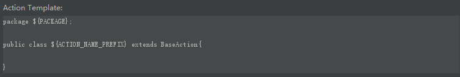
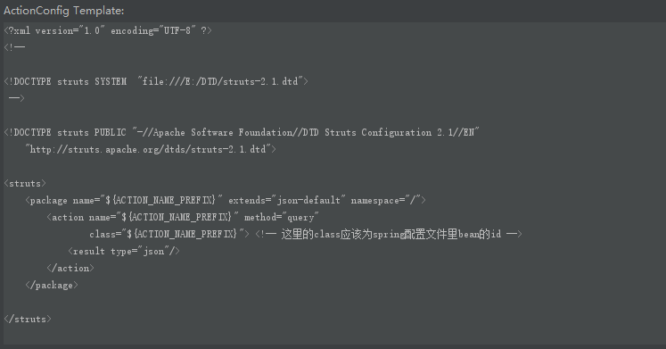
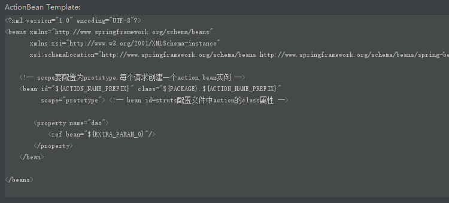
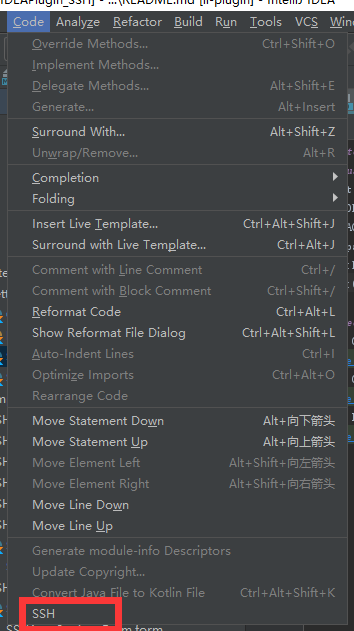
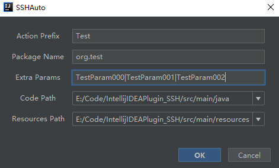

#SSHAuto
###Defualt Params
default params: 
${ACTION_NAME_PREFIX} 
${PACKAGE} 
extra params: 
prefix:EXTRA_PARAM_ 
suffix:0...
Extra Params value split by '|'

###Screenshots
Action Code Screenshots:

Action Config Code Screenshots:

Action Beans Code Screenshots:

Code-SSH:

Code-SSH-Dialog(Extra Params value split by '|'):

